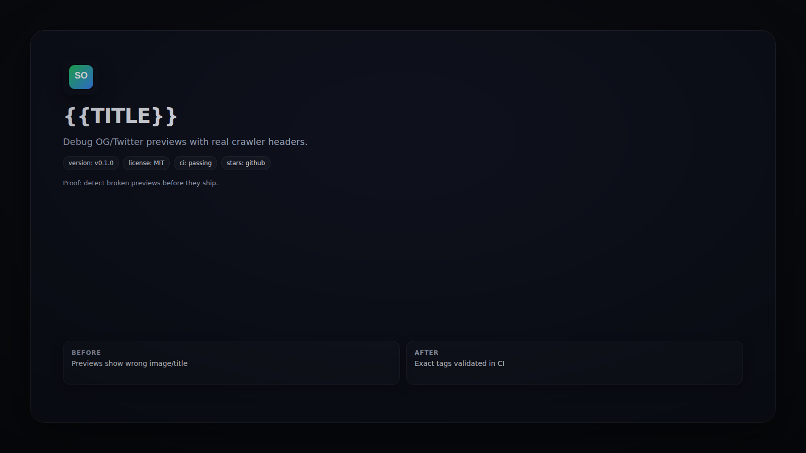

# social-preview-doctor



   

Debug OG/Twitter previews with real crawler headers.

## Quickstart
```bash
npx social-preview-doctor https://example.com
```

## Demo
```bash
social-preview-doctor https://example.com --json
```

## Why This Exists
Social crawlers are picky. This checks headers, redirects, and OG/Twitter tags in the same way they do.

## FAQ
- **Does it follow redirects?** Yes, up to `--max-redirects`.
- **Can it fail CI?** Yes, via baseline diffs.

## Contributing
See `CONTRIBUTING.md` for the workflow and tests.

## License
MIT
