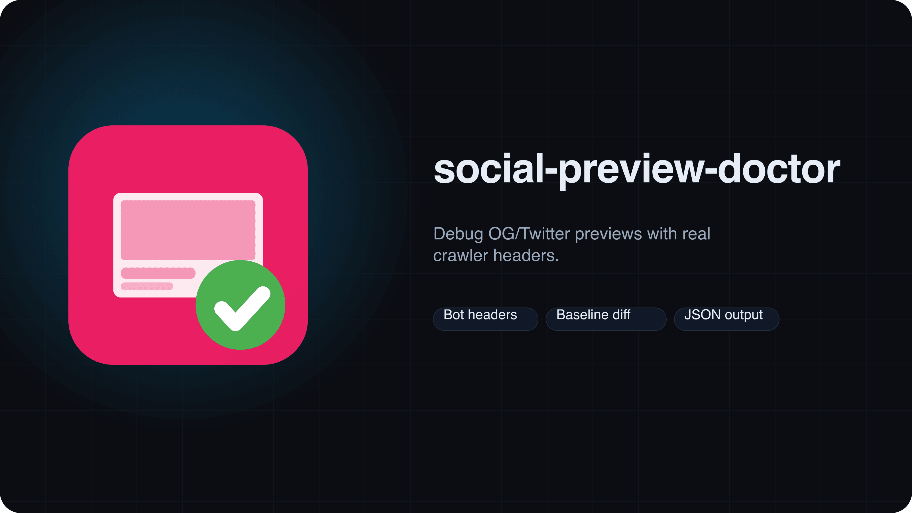

<picture>
  <source srcset="branding/hero.svg" type="image/svg+xml">
  
</picture>

# social-preview-doctor
Debug OG/Twitter previews with real crawler headers. Emulate social bots to validate previews before they ship.

   

> [!IMPORTANT]
> Run against URLs you trust. The crawler emulation follows redirects and reports missing tags.

## Quickstart
```bash
npx social-preview-doctor https://example.com
```

## Demo


```bash
social-preview-doctor https://example.com --json
```

## Docs
Start here: [Requirements](#requirements) · [Usage](#usage) · [GitHub Action](#github-action) · [JSON Output](#json-output) · [Exit Codes](#exit-codes) · [Troubleshooting](#troubleshooting)

## Contributing
See `CONTRIBUTING.md`.

## Requirements

- Node.js 20+
- Network access to the target URL

## Usage

```bash
social-preview-doctor https://example.com
social-preview-doctor https://example.com --bot twitter --json
social-preview-doctor https://example.com --baseline og-baseline.json --update-baseline
```

**Options**

- `--bot <linkedin|twitter|facebook>` Bot user-agent preset (default `linkedin`).
- `--json` Emit machine-readable JSON.
- `--baseline <path>` Compare current metadata to a baseline JSON file.
- `--update-baseline` Write baseline JSON and exit.
- `--max-redirects <n>` Max redirect hops (default `5`).
- `--timeout <ms>` Request timeout in ms (default `15000`).

## GitHub Action

```yaml
- uses: PetriLahdelma/social-preview-doctor@v0
  with:
    url: https://example.com
    user_agent: twitter
    json: "true"
```

## Why This Exists

Social crawlers are picky. This checks headers, redirects, and OG/Twitter tags in the same way they do.

## JSON Output

```json
{
  "url": "https://example.com",
  "finalUrl": "https://example.com/",
  "chain": [
    { "url": "https://example.com", "status": 301, "location": "https://example.com/" }
  ],
  "meta": { "og:title": "Example" },
  "cache": { "content-type": "text/html; charset=UTF-8" },
  "diagnostics": [{ "level": "warn", "code": "missing-og-image", "message": "Missing og:image" }],
  "ms": 1234
}
```

## Exit Codes

- `0` Success
- `1` Runtime/config error
- `2` Baseline diff detected

## Troubleshooting

- **Unsupported bot**: Use `--bot linkedin|twitter|facebook`.
- **No HTML**: Ensure the final response is `text/html`.
- **Baseline diff**: Re-run with `--update-baseline` to refresh expected values.
- **Timeouts**: Increase `--timeout` for slow pages.
- **Redirect loops**: Reduce `--max-redirects` or fix the target URL.

## FAQ

- **Does it follow redirects?** Yes, up to `--max-redirects`.
- **Can it fail CI?** Yes, via baseline diffs.

## License

MIT

