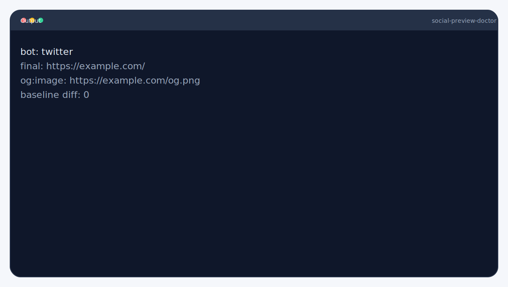

<picture>
  <source srcset="branding/hero.svg" type="image/svg+xml">
  
</picture>

# Social Preview Doctor
Debug OG/Twitter previews with real crawler headers. Emulates real bots so you can fix previews before they ship.

**Type:** CLI (Node.js)

   

> [!IMPORTANT]
> Run against URLs you trust. The crawler emulation follows redirects and reports missing tags.

## Highlights
- Emulates social crawlers and headers.
- Validates OG/Twitter tags and redirects.
- Structured JSON output for automation.


## Output


Example artifacts live in `examples/`.

Need help? Start with `docs/troubleshooting.md`.

Crawler presets: `linkedin`, `twitter`, `facebook`.


## Quickstart
```bash
npx social-preview-doctor https://example.com
```


## CI in 60s
```yaml
- name: Validate social previews
  run: npx social-preview-doctor https://example.com --bot twitter --json
```

## Demo


```bash
social-preview-doctor https://example.com --json
```


## Compatibility
- Node.js: 20 (CI on ubuntu-latest).
- OS: Linux in CI; macOS/Windows unverified.
- External deps: outbound HTTPS access.

## Guarantees & Non-Goals
**Guarantees**
- Uses known crawler headers for LinkedIn/Twitter/Facebook.
- Reports redirect chains and extracted meta tags.

**Non-Goals**
- Does not bypass bot blocking or WAFs.
- Does not invalidate caches by itself.

## Docs
- [Requirements](docs/requirements.md)
- [Usage](docs/usage.md)
- [Crawler Profiles](docs/crawler-profiles.md)
- [Cache Busting](docs/cache-busting.md)
- [Failure Modes](docs/failure-modes.md)
- [JSON Output](docs/json-output.md)
- [Troubleshooting](docs/troubleshooting.md)
- [Guarantees & Non-Goals](docs/guarantees.md)
- [Constraints](docs/constraints.md)

More: [docs/README.md](docs/README.md)

## Examples
See `examples/README.md` for inputs and expected outputs.

## Used By
Open a PR to add your org.


## Contributing
See `CONTRIBUTING.md`.

## License

MIT
